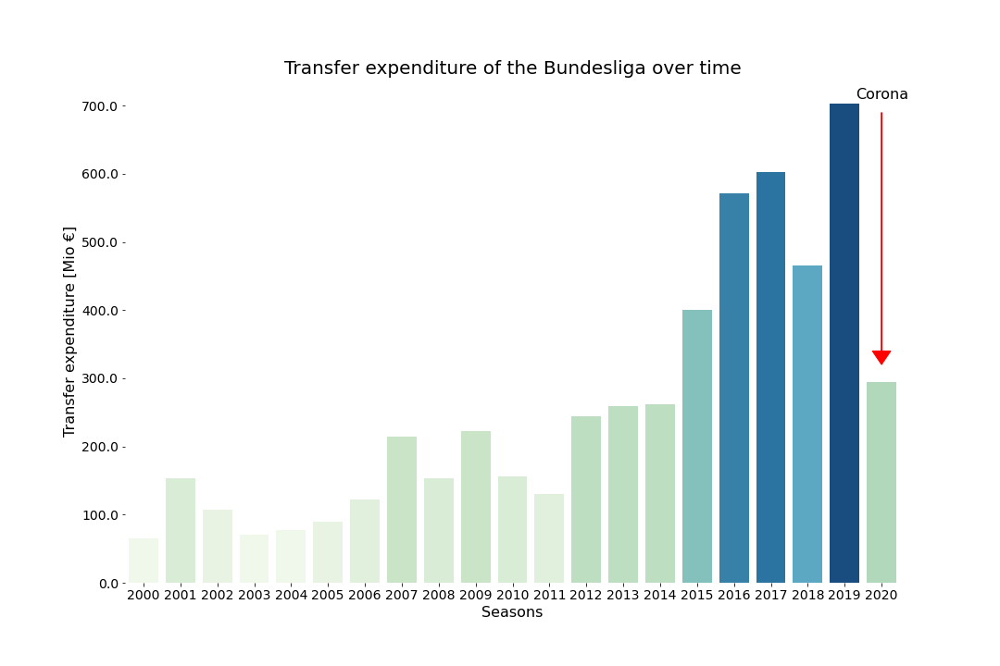
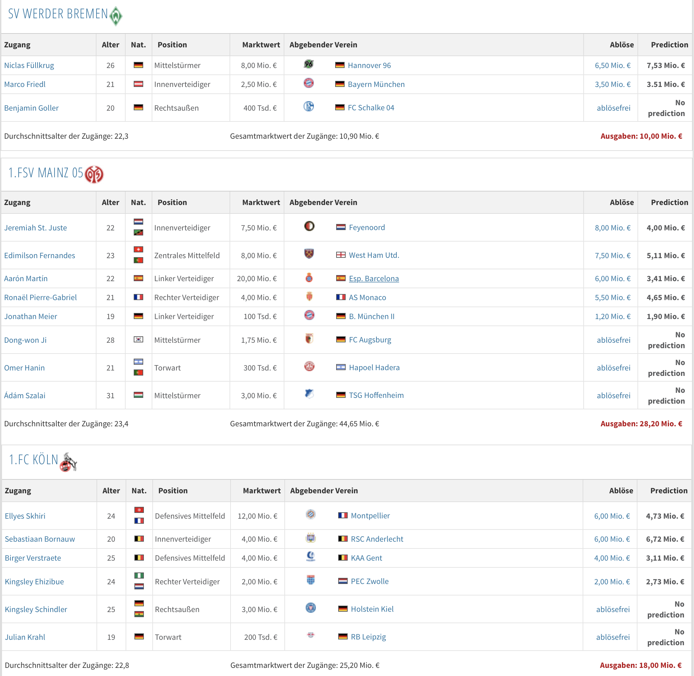

 
# Analysis of the German football transfer market
An analysis of the  German football market using data from transfermakrt.de.

This project is split in two parts:
1) scraper
2) analysis, incl. transfer fees prediction

## scraper
The scraping folder contains:
- a script to scrape transfer-, player- and team-level information from transfermarkt.de
- A usage example
- detailed instructions

## analysis
In depth analysis of the German transfer market over time and predicting transfer fees, using the data from the scraper

### Example predictions for 2019:
